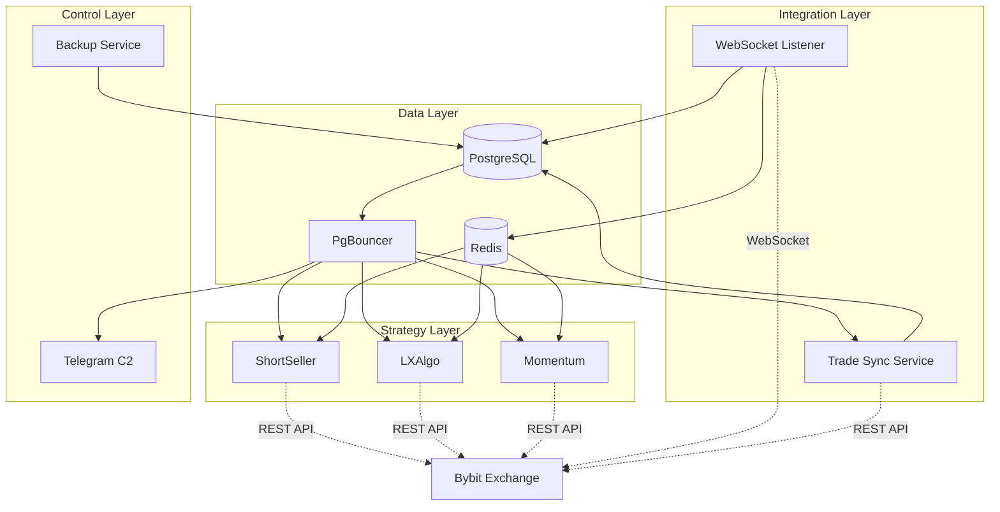

# Alpha Trading System - Architecture Overview

## Quick Reference

### Service Ports
| Service | Internal Port | External Port | Purpose |
|---------|--------------|---------------|---------|
| PostgreSQL | 5432 | 5433 | Trade database |
| PgBouncer | 6432 | 6432 | Connection pooler |
| Redis | 6379 | 6379 | Live state cache |

### Bot Configuration
| Bot | Bot ID | Redis DB | Entry Point | GitHub |
|-----|--------|----------|-------------|--------|
| ShortSeller | shortseller_001 | 0 | scripts/start_trading.py | [shortseller](https://github.com/LiamX-Labs/shortseller) |
| LXAlgo | lxalgo_001 | 1 | main.py | [lxalgo](https://github.com/LiamX-Labs/lxalgo) |
| Momentum | momentum_001 | 2 | trading_system.py | [apex-momentum-trading](https://github.com/LiamX-Labs/apex-momentum-trading) |

## Service Dependencies



## Data Flow Architecture

### 1. Trade Execution Flow

```
┌─────────────┐
│  Strategy   │ 1. Generate Signal
└──────┬──────┘
       │
       ▼
┌─────────────┐
│   Bybit     │ 2. Place Order (REST API)
│   REST API  │
└──────┬──────┘
       │
       ▼
┌─────────────┐
│   Bybit     │ 3. Execute Order
│  Exchange   │
└──────┬──────┘
       │
       ▼
┌─────────────┐
│  WebSocket  │ 4. Receive Execution Event
│  Listener   │
└──────┬──────┘
       │
       ├─────────────────┬──────────────────┐
       ▼                 ▼                  ▼
┌─────────────┐   ┌─────────────┐   ┌─────────────┐
│ PostgreSQL  │   │    Redis    │   │  Strategy   │
│ (fills)     │   │ (position)  │   │  (update)   │
└─────────────┘   └─────────────┘   └─────────────┘
```

### 2. Database Write Pattern

**CRITICAL**: Only WebSocket Listener writes fills

```
                    ┌─────────────────┐
                    │   WebSocket     │
                    │    Listener     │
                    └────────┬────────┘
                             │
                    ONLY WRITER TO FILLS
                             │
                             ▼
                    ┌─────────────────┐
                    │  trading.fills  │
                    │  (source of     │
                    │   truth)        │
                    └─────────────────┘
                             │
                    ┌────────┴────────┐
                    │                 │
                    ▼                 ▼
            ┌──────────────┐  ┌──────────────┐
            │ Analytics    │  │ Performance  │
            │ Queries      │  │ Tracking     │
            └──────────────┘  └──────────────┘
```

### 3. Read Pattern

```
┌─────────────┐
│  Strategy   │
└──────┬──────┘
       │
       ├────────────────────┬─────────────────────┐
       │                    │                     │
       ▼                    ▼                     ▼
┌─────────────┐      ┌─────────────┐     ┌─────────────┐
│    Redis    │      │  PgBouncer  │     │  Bybit API  │
│  (current   │      │ (historical │     │  (market    │
│  position)  │      │   trades)   │     │   data)     │
└─────────────┘      └─────────────┘     └─────────────┘
```

## Container Architecture

### Resource Allocation

```
┌─────────────────────────────────────────────────────────────┐
│                    Host Machine                              │
├─────────────────────────────────────────────────────────────┤
│                                                               │
│  ┌───────────────────────────────────────────────────────┐  │
│  │              trading-network (bridge)                  │  │
│  │                                                         │  │
│  │  ┌──────────────┐  ┌──────────────┐  ┌─────────────┐ │  │
│  │  │ PostgreSQL   │  │    Redis     │  │  PgBouncer  │ │  │
│  │  │ No Limit     │  │  No Limit    │  │  No Limit   │ │  │
│  │  └──────────────┘  └──────────────┘  └─────────────┘ │  │
│  │                                                         │  │
│  │  ┌──────────────┐  ┌──────────────┐  ┌─────────────┐ │  │
│  │  │ ShortSeller  │  │   LXAlgo     │  │  Momentum   │ │  │
│  │  │ No Limit     │  │  900MB       │  │   900MB     │ │  │
│  │  └──────────────┘  └──────────────┘  └─────────────┘ │  │
│  │                                                         │  │
│  │  ┌──────────────┐  ┌──────────────┐  ┌─────────────┐ │  │
│  │  │  WebSocket   │  │  Telegram    │  │ Trade Sync  │ │  │
│  │  │  Listener    │  │    C2        │  │   Service   │ │  │
│  │  │  No Limit    │  │   256MB      │  │    512MB    │ │  │
│  │  └──────────────┘  └──────────────┘  └─────────────┘ │  │
│  │                                                         │  │
│  └───────────────────────────────────────────────────────┘  │
│                                                               │
└─────────────────────────────────────────────────────────────┘
```

### Volume Mounts

```
Host                           Container
────────────────────────────────────────────────────────
./database/migrations/    →    /docker-entrypoint-initdb.d/
./database/backups/       ↔    /backups
./websocket_listener/logs ↔    /app/logs
./telegram_manager/logs   ↔    /app/logs
./trade_sync_service/logs ↔    /app/logs
./strategies/shortseller/ ↔    /app
./strategies/lxalgo/      ↔    /app
./strategies/momentum/    ↔    /app (read-only for code)

Named Volumes:
──────────────
postgres_data (persistent database)
redis_data (persistent cache)
lxalgo_logs (persistent logs)
momentum_data (cache/temp data)
```

## Health Check Strategy

### Startup Sequence with Health Checks

```
1. PostgreSQL starts
   └─> Health: pg_isready every 10s
        └─> HEALTHY after ~10s

2. Redis starts (parallel with PG)
   └─> Health: redis-cli ping every 10s
        └─> HEALTHY after ~10s

3. PgBouncer starts (depends on PG healthy)
   └─> No health check (immediate start)

4. WebSocket Listener starts (depends on PG+Redis healthy)
   └─> Health: Python process check every 60s
        └─> HEALTHY after ~10s (start_period)

5. All Strategies start (depends on PG+Redis+WebSocket)
   └─> Health: Process checks every 60s
        └─> HEALTHY after ~30s (start_period)

6. Support Services start (parallel)
   - Telegram C2
   - Trade Sync
   - Backup Service
```

## Network Communication

### Internal Service Discovery

All services use Docker's built-in DNS:

```python
# ✅ CORRECT: Use container names
POSTGRES_HOST = "postgres"
REDIS_HOST = "redis"

# ❌ WRONG: Don't use localhost or IPs
POSTGRES_HOST = "localhost"  # Won't work!
REDIS_HOST = "127.0.0.1"     # Won't work!
```

### Port Mapping

```
External Access (from host):
  localhost:5433 → PostgreSQL
  localhost:6432 → PgBouncer
  localhost:6379 → Redis

Internal Access (container-to-container):
  postgres:5432 → PostgreSQL
  pgbouncer:6432 → PgBouncer
  redis:6379 → Redis
```

## Strategy Integration Points

### Each Strategy Must:

1. **Connect to Redis** for real-time position data
   ```python
   REDIS_HOST = os.getenv("REDIS_HOST", "redis")
   REDIS_PORT = int(os.getenv("REDIS_PORT", 6379))
   REDIS_DB = int(os.getenv("REDIS_DB", 0))  # Unique per bot
   ```

2. **Optionally connect to PostgreSQL** for historical queries
   ```python
   POSTGRES_HOST = os.getenv("POSTGRES_HOST", "pgbouncer")  # Use PgBouncer!
   POSTGRES_PORT = int(os.getenv("POSTGRES_PORT", 6432))
   ```

3. **Use unique Bot ID** for identification
   ```python
   BOT_ID = os.getenv("BOT_ID", "strategy_001")
   ```

4. **Tag orders with client_order_id** for tracking
   ```python
   client_order_id = f"{BOT_ID}:entry:{timestamp}"
   # Format: bot_id:reason:timestamp
   # Reasons: entry, trailing_stop, take_profit, stop_loss, etc.
   ```

5. **Read position updates from Redis** (written by WebSocket Listener)
   - Don't write fills to PostgreSQL (only WebSocket does this)
   - Read current position from Redis
   - Query historical from PostgreSQL if needed

## Database Schema Key Points

### Bot Registration
```sql
-- All bots registered in trading.bots table
INSERT INTO trading.bots (bot_id, bot_name, bot_type, strategy_name)
VALUES ('shortseller_001', 'Multi-Asset EMA Bot', 'shortseller', 'EMA 240/600');
```

### Fills Table (Single Source of Truth)
```sql
-- WebSocket writes every execution here
INSERT INTO trading.fills (
    bot_id, symbol, order_id, client_order_id,
    side, exec_price, exec_qty, exec_time, commission, close_reason
) VALUES (...);
```

### Position Tracking
```
Redis Key Pattern:
  position:{bot_id}:{symbol} → JSON {qty, avg_price, unrealized_pnl}

Example:
  position:shortseller_001:BTCUSDT → {"qty": -0.5, "avg_price": 42000, ...}
```

## Configuration Best Practices

### Environment Variables Priority

1. **Container environment** (highest priority)
   - Set in docker-compose.yml
   - Override everything else

2. **Docker Compose .env file**
   - Used for ${VAR} substitution in docker-compose.yml
   - Shared across services

3. **Strategy-specific .env**
   - Loaded inside container
   - Strategy defaults

### Recommended .env Structure

```bash
# Root .env (for docker-compose)
POSTGRES_PASSWORD=secure_password
REDIS_PASSWORD=secure_redis_pass

# Per-bot API keys
SHORTSELLER_BYBIT_API_KEY=xxx
SHORTSELLER_BYBIT_API_SECRET=xxx
LXALGO_BYBIT_API_KEY=xxx
LXALGO_BYBIT_API_SECRET=xxx
MOMENTUM_BYBIT_API_KEY=xxx
MOMENTUM_BYBIT_API_SECRET=xxx

# Telegram
C2_TELEGRAM_BOT_TOKEN=xxx
C2_TELEGRAM_ADMIN_IDS=123456789
```

## Monitoring and Observability

### Key Metrics to Monitor

1. **Database**
   - Connection count (PgBouncer stats)
   - Query latency
   - Disk usage

2. **Redis**
   - Memory usage
   - Hit rate
   - Connected clients

3. **WebSocket Listener**
   - Messages received/second
   - Write latency to PostgreSQL
   - Error rate

4. **Strategies**
   - Active positions
   - Orders placed
   - Fill rate
   - P&L

### Log Locations

```bash
# Infrastructure logs
docker compose logs -f postgres
docker compose logs -f redis
docker compose logs -f websocket_listener

# Strategy logs
docker compose logs -f shortseller
docker compose logs -f lxalgo
docker compose logs -f momentum

# Support services
docker compose logs -f telegram_manager
docker compose logs -f trade_sync_service
```

## Disaster Recovery

### Backup Strategy

1. **Automated Backups** (daily at 2 AM)
   - PostgreSQL full dump
   - 30 days daily
   - 12 weeks weekly
   - 12 months monthly

2. **Manual Backup**
   ```bash
   docker exec trading_postgres pg_dump -U trading_user trading_db > backup.sql
   ```

3. **Restore**
   ```bash
   docker exec -i trading_postgres psql -U trading_user -d trading_db < backup.sql
   ```

### Redis Persistence

Redis uses AOF (Append-Only File):
- `appendfsync everysec` - write every second
- Volume: `redis_data` (persistent)
- Recovery: Automatic on restart

## Scaling Considerations

### Current Architecture (Single Host)

All services run on one machine, suitable for:
- 3 trading strategies
- Moderate trade frequency
- Up to ~1000 fills/day

### Future Scaling (Multi-Host)

To scale beyond single host:

1. **Separate Database Tier**
   - Managed PostgreSQL (AWS RDS, etc.)
   - Redis cluster

2. **Strategy Scaling**
   - Deploy strategies on separate hosts
   - Share database/redis infrastructure

3. **Load Balancing**
   - Multiple WebSocket listeners
   - Message queue (RabbitMQ/Kafka)

## Security Checklist

- [ ] Change default PostgreSQL password
- [ ] Change default Redis password
- [ ] Secure Bybit API keys (read-only if possible)
- [ ] Restrict Telegram admin IDs
- [ ] Enable firewall (only expose necessary ports)
- [ ] Regular security updates
- [ ] Audit Docker socket access
- [ ] Encrypt backups

## See Also

- [INTEGRATION.md](INTEGRATION.md) - Detailed integration guide
- [README.md](README.md) - Getting started
- [docker-compose.production.yml](docker-compose.production.yml) - Full configuration
