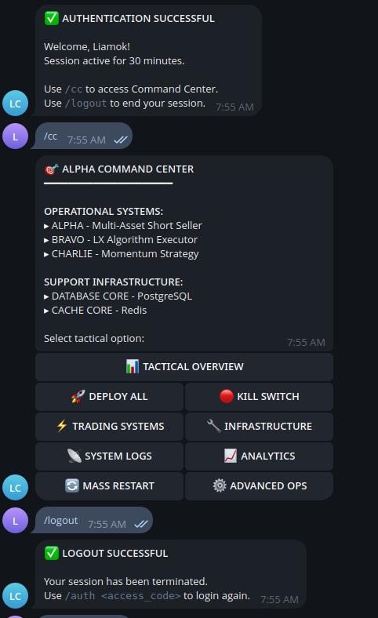
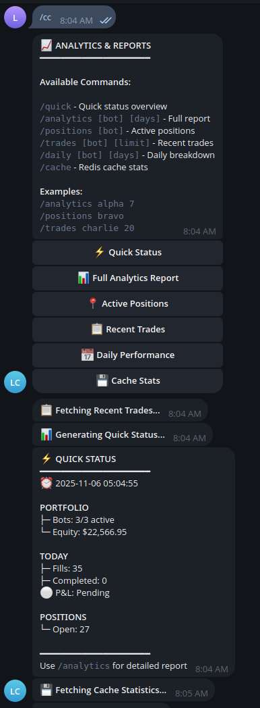
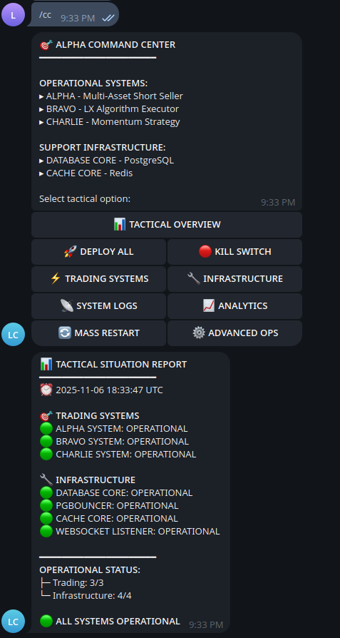
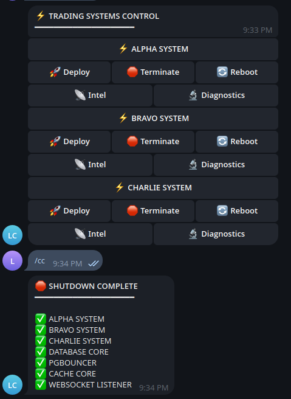
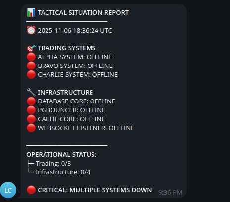

# 🚀 Multi-Strategy Cryptocurrency Trading Platform
## Enterprise-Grade Distributed Trading Infrastructure

[](https://opensource.org/licenses/MIT)
[](https://www.python.org/)
[](https://www.docker.com/)
[](https://www.postgresql.org/)
[](https://redis.io/)

> **Production-ready cryptocurrency trading platform** featuring microservices architecture, PostgreSQL with connection pooling, Redis caching, WebSocket real-time data, and unified Docker orchestration.

---

## 📊 Platform Overview

### **System Statistics**

- **🔢 Total Codebase**: 16,644+ lines of production Python
- **⚙️ Trading Strategies**: 3 independent, coordinated bots
- **🗄️ Database**: Unified PostgreSQL + PgBouncer connection pooling
- **⚡ Cache Layer**: Redis for real-time position state
- **📡 Real-Time Data**: WebSocket listener for live market streams
- **🤖 Command & Control**: Telegram bot for remote management
- **🐳 Deployment**: Single-command Docker Compose orchestration
- **📈 Production Status**: Battle-tested, production-ready

###  **What This Platform Demonstrates**

**For Technical Interviews & Portfolio:**
- ✅ **Microservices Architecture** - Independent, scalable services with clean interfaces
- ✅ **Database Optimization** - PostgreSQL with PgBouncer connection pooling
- ✅ **Real-Time Processing** - WebSocket streaming, sub-second latency
- ✅ **Docker Mastery** - Multi-service orchestration, health checks, volumes
- ✅ **System Design** - Distributed systems, data flow architecture
- ✅ **Production Engineering** - Monitoring, logging, error handling
- ✅ **DevOps Skills** - Deployment automation, containerization

**For Potential Clients:**
- 📊 Enterprise-grade trading infrastructure
- 🎯 Multi-strategy orchestration capabilities
- 🔒 Production-ready security and reliability
- 📈 Scalable architecture for growth
- 🛠️ Professional documentation and maintenance

---

## 🏗️ System Architecture

### **High-Level Architecture**

```
┌──────────────────────────────────────────────────────────────────────────┐
│                     ALPHA TRADING PLATFORM                                │
│                    Production-Ready Infrastructure                         │
├──────────────────────────────────────────────────────────────────────────┤
│                                                                            │
│  ┌─────────────────────────── STRATEGY LAYER ────────────────────────┐  │
│  │                                                                      │  │
│  │   ┌──────────────┐  ┌──────────────┐  ┌──────────────┐          │  │
│  │   │ ShortSeller  │  │   LXAlgo     │  │  Momentum    │          │  │
│  │   │ (1,863 LOC)  │  │ (4,397 LOC)  │  │ (10,384 LOC) │          │  │
│  │   │              │  │              │  │              │          │  │
│  │   │ • EMA Cross  │  │ • Tech Ana   │  │ • Breakout   │          │  │
│  │   │ • Multi-Asset│  │ • Prop Trade │  │ • Momentum   │          │  │
│  │   │ • Regime Det │  │ • Risk Mgmt  │  │ • Backtesting│          │  │
│  │   └───────┬──────┘  └───────┬──────┘  └───────┬──────┘          │  │
│  │           │                 │                 │                  │  │
│  └───────────┼─────────────────┼─────────────────┼──────────────────┘  │
│              │                 │                 │                      │
│              └─────────────┬───┴─────────────────┘                      │
│                            │                                             │
│  ┌─────────────────── INFRASTRUCTURE LAYER ───────────────────────────┐ │
│  │                         │                                            │ │
│  │   ┌──────────────────────▼──────────────────────┐                  │ │
│  │   │      SHARED DATABASE & CACHING               │                  │ │
│  │   ├──────────────────────────────────────────────┤                  │ │
│  │   │  ┌────────────┐  ┌──────────┐  ┌─────────┐ │                  │ │
│  │   │  │ PostgreSQL │──│ PgBouncer│  │  Redis  │ │                  │ │
│  │   │  │            │  │          │  │         │ │                  │ │
│  │   │  │ • Fills DB │  │ • Pool   │  │ • State │ │                  │ │
│  │   │  │ • Trades   │  │ • Mgmt   │  │ • Cache │ │                  │ │
│  │   │  └────────────┘  └──────────┘  └─────────┘ │                  │ │
│  │   └──────────────────────────────────────────────┘                  │ │
│  │                            │                                         │ │
│  └────────────────────────────┼─────────────────────────────────────────┘ │
│                               │                                           │
│  ┌──────────────────── INTEGRATION LAYER ──────────────────────────────┐ │
│  │                            │                                          │ │
│  │   ┌──────────────┐  ┌──────▼──────┐  ┌───────────────┐           │ │
│  │   │  WebSocket   │  │Trade Sync   │  │   Telegram    │           │ │
│  │   │  Listener    │  │  Service    │  │   C2 Bot      │           │ │
│  │   │              │  │             │  │               │           │ │
│  │   │ • Real-time  │  │ • Reconcile │  │ • /analytics  │           │ │
│  │   │ • Bybit API  │  │ • Backfill  │  │ • /positions  │           │ │
│  │   │ • Market Data│  │ • Per-bot   │  │ • /status     │           │ │
│  │   └──────────────┘  └─────────────┘  └───────────────┘           │ │
│  │                                                                      │ │
│  └──────────────────────────────────────────────────────────────────────┘ │
│                                                                            │
│  ┌───────────────────── EXCHANGE LAYER ────────────────────────────────┐ │
│  │                              │                                         │ │
│  │                    ┌─────────▼─────────┐                            │ │
│  │                    │  Bybit Exchange   │                            │ │
│  │                    │  (API V5)         │                            │ │
│  │                    │                   │                            │ │
│  │                    │  • REST API       │                            │ │
│  │                    │  • WebSocket      │                            │ │
│  │                    │  • Order Exec     │                            │ │
│  │                    └───────────────────┘                            │ │
│  └──────────────────────────────────────────────────────────────────────┘ │
│                                                                            │
└──────────────────────────────────────────────────────────────────────────┘
```

### **Data Flow Architecture**

```
┌─────────────────────────────────────────────────────────────────────┐
│                         TRADE EXECUTION FLOW                         │
└─────────────────────────────────────────────────────────────────────┘

1. SIGNAL GENERATION
   ┌──────────────┐
   │  Strategy    │  Analyzes market data
   │  Engine      │  Generates trade signal
   └──────┬───────┘
          │
          ▼
2. ORDER PLACEMENT
   ┌──────────────┐
   │  Bybit       │  Places order via REST API
   │  REST API    │  Client order ID tagged
   └──────┬───────┘
          │
          ▼
3. ORDER EXECUTION
   ┌──────────────┐
   │  Bybit       │  Order fills on exchange
   │  Exchange    │  Execution confirmed
   └──────┬───────┘
          │
          ▼
4. REAL-TIME UPDATE
   ┌──────────────┐
   │  WebSocket   │  Receives fill notification
   │  Listener    │  Parses execution data
   └──────┬───────┘
          │
          ├─────────────────┬──────────────────┬────────────────┐
          ▼                 ▼                  ▼                ▼
   ┌──────────────┐  ┌──────────────┐  ┌──────────────┐  ┌────────────┐
   │ PostgreSQL   │  │    Redis     │  │  Strategy    │  │  Telegram  │
   │              │  │              │  │              │  │            │
   │ • Fills      │  │ • Position   │  │ • Update     │  │ • Notify   │
   │ • History    │  │ • State      │  │ • Track      │  │ • Alert    │
   └──────────────┘  └──────────────┘  └──────────────┘  └────────────┘
```

### **Write Pattern (Critical Design Decision)**

```
┌─────────────────────────────────────────────────────────────────────┐
│            SINGLE WRITER PATTERN FOR DATA INTEGRITY                  │
└─────────────────────────────────────────────────────────────────────┘

                    ┌─────────────────┐
                    │   WebSocket     │
                    │    Listener     │
                    │                 │
                    │ ONLY WRITER TO  │
                    │  trading.fills  │
                    └────────┬────────┘
                             │
                    ┌────────▼────────┐
                    │  trading.fills  │
                    │  (PostgreSQL)   │
                    │                 │
                    │ Single Source   │
                    │  of Truth       │
                    └────────┬────────┘
                             │
                    ┌────────┴────────┐
                    │                 │
                    ▼                 ▼
            ┌──────────────┐  ┌──────────────┐
            │ Analytics    │  │ Performance  │
            │ Queries      │  │ Tracking     │
            └──────────────┘  └──────────────┘
```

**Why Single Writer Pattern?**
- ✅ **Data Integrity**: No race conditions or duplicate fills
- ✅ **Consistency**: Single source of truth for all trades
- ✅ **Scalability**: Strategies read, only WebSocket writes
- ✅ **Auditability**: Clear data lineage

---

## 🎯 Core Services

### **1. PostgreSQL Database**

**Purpose**: Centralized persistent storage for all trading data

**Configuration**:
```yaml
ports: "5433:5432"  # External access via 5433
volumes: postgres_data (persistent)
health_check: pg_isready every 10s
```

**Schema Design**:
```sql
-- Fills Table (Single Source of Truth)
CREATE TABLE trading.fills (
    id SERIAL PRIMARY KEY,
    bot_id VARCHAR(50) NOT NULL,
    symbol VARCHAR(20) NOT NULL,
    order_id VARCHAR(100),
    client_order_id VARCHAR(200),
    side VARCHAR(10),
    exec_price DECIMAL(20, 8),
    exec_qty DECIMAL(20, 8),
    exec_time TIMESTAMP,
    commission DECIMAL(20, 8),
    close_reason VARCHAR(50),
    created_at TIMESTAMP DEFAULT NOW()
);

-- Bot Registry
CREATE TABLE trading.bots (
    bot_id VARCHAR(50) PRIMARY KEY,
    bot_name VARCHAR(100),
    bot_type VARCHAR(50),
    strategy_name VARCHAR(100),
    last_heartbeat TIMESTAMP,
    status VARCHAR(20),
    created_at TIMESTAMP DEFAULT NOW()
);

-- Indexes for Performance
CREATE INDEX idx_fills_bot_id ON trading.fills(bot_id);
CREATE INDEX idx_fills_symbol ON trading.fills(symbol);
CREATE INDEX idx_fills_exec_time ON trading.fills(exec_time DESC);
```

**Query Examples**:
```sql
-- Get trades per strategy
SELECT bot_id, COUNT(*) as trades, SUM(exec_price * exec_qty) as volume
FROM trading.fills
GROUP BY bot_id;

-- Recent fills
SELECT * FROM trading.fills
ORDER BY exec_time DESC
LIMIT 10;

-- Daily P&L by strategy
SELECT
    bot_id,
    DATE(exec_time) as date,
    SUM(CASE WHEN side = 'Buy' THEN -exec_price * exec_qty ELSE exec_price * exec_qty END) as pnl
FROM trading.fills
GROUP BY bot_id, DATE(exec_time)
ORDER BY date DESC;
```

---

### **2. PgBouncer (Connection Pooling)**

**Purpose**: Optimize database connections and prevent exhaustion

**Why It's Critical**:
- **Problem**: Each strategy creates multiple database connections
- **Solution**: PgBouncer pools connections, reuses them efficiently
- **Result**: Prevents "too many connections" errors in production

**Configuration**:
```ini
[databases]
trading_db = host=postgres port=5432 dbname=trading_db

[pgbouncer]
pool_mode = transaction
max_client_conn = 100
default_pool_size = 20
reserve_pool_size = 5
reserve_pool_timeout = 3
```

**Connection Pattern**:
```python
# ✅ CORRECT: Always connect via PgBouncer
POSTGRES_HOST = "pgbouncer"  # Container name
POSTGRES_PORT = 6432          # PgBouncer port

# ❌ WRONG: Don't bypass PgBouncer
# POSTGRES_HOST = "postgres"
# POSTGRES_PORT = 5432
```

**Benefits**:
- ✅ Reduces connection overhead
- ✅ Improves query performance
- ✅ Prevents connection exhaustion
- ✅ Essential for production scale

---

### **3. Redis Cache**

**Purpose**: High-performance caching and real-time position state

**Use Cases**:
1. **Position State** (Primary):
   ```python
   # Key pattern: position:{bot_id}:{symbol}
   position:shortseller_001:BTCUSDT → {
       "size": -0.5,
       "side": "Sell",
       "avg_price": 42000.00,
       "unrealized_pnl": 250.00,
       "updated_at": "2025-11-07T10:30:00Z"
   }
   ```

2. **Market Data Caching**:
   ```python
   # Cache recent price data
   market:BTCUSDT:price → 42150.00
   market:BTCUSDT:volume → 1250000.00
   ```

3. **Inter-Service Communication**:
   ```python
   # Pub/Sub for real-time updates
   PUBLISH fills_channel {"symbol": "BTCUSDT", "side": "Buy", ...}
   ```

**Configuration**:
```yaml
redis:
  ports: "6379:6379"
  volumes: redis_data (persistent)
  persistence: AOF (appendfsync everysec)

# Per-bot database isolation
shortseller: REDIS_DB=0
lxalgo: REDIS_DB=1
momentum: REDIS_DB=2
```

**Access Examples**:
```bash
# Connect to Redis
docker exec -it trading_redis redis-cli

# View all keys
KEYS *

# Get position data
GET position:shortseller_001:BTCUSDT

# Monitor real-time updates
MONITOR
```

---

### **4. WebSocket Listener**

**Purpose**: Real-time market data streaming from Bybit

**Features**:
- Bybit WebSocket V5 integration
- Multi-symbol subscriptions
- Automatic reconnection logic
- Data distribution via Redis
- Fill recording to PostgreSQL

**Supported Streams**:
```python
subscriptions = [
    "execution",      # Trade executions
    "position",       # Position updates
    "order",          # Order status
    "kline.5",        # 5-minute candles
]
```

**Data Flow**:
```
Bybit WebSocket
       │
       ▼
WebSocket Listener
       │
       ├──────────► PostgreSQL (write fills)
       │
       └──────────► Redis (update positions)
```

**Implementation Pattern**:
```python
async def on_execution(data):
    """Handle execution messages"""
    # 1. Parse execution data
    fill_data = parse_execution(data)

    # 2. Write to PostgreSQL
    await write_fill_to_db(fill_data)

    # 3. Update Redis position
    await update_position_redis(fill_data)

    # 4. Publish to channels
    await redis.publish('fills_channel', fill_data)
```

---

### **5. Trade Sync Service**

**Purpose**: Automated trade reconciliation and historical backfill

**Features**:
- Per-strategy API key support
- Automatic trade reconciliation
- Duplicate detection
- Historical data backfill
- Scheduled synchronization

**Commands**:
```bash
# Backfill historical trades
docker exec trade_sync_service python main.py backfill --months 3

# Manual sync
docker exec trade_sync_service python main.py sync

# Check sync status
docker exec trade_sync_service python main.py status
```

**Configuration**:
```python
# Per-bot API keys for trade attribution
SHORTSELLER_BYBIT_API_KEY = os.getenv('SHORTSELLER_BYBIT_API_KEY')
LXALGO_BYBIT_API_KEY = os.getenv('LXALGO_BYBIT_API_KEY')
MOMENTUM_BYBIT_API_KEY = os.getenv('MOMENTUM_BYBIT_API_KEY')
```

---

### **6. Telegram Command & Control**

**Purpose**: Remote monitoring and management via Telegram bot

**LX Command Center in Action**:

<table>
  <tr>
    <td align="center" width="33%">
      <br>
      <sub>Authentication &amp; tactical command menu</sub>
    </td>
    <td align="center" width="33%">
      <br>
      <sub>Quick status — bots, equity &amp; positions</sub>
    </td>
    <td align="center" width="33%">
      <br>
      <sub>Tactical situation report — all systems operational</sub>
    </td>
  </tr>
  <tr>
    <td align="center" width="33%">
      <br>
      <sub>Per-system deploy / terminate / reboot controls</sub>
    </td>
    <td align="center" width="33%">
      <br>
      <sub>Kill switch — emergency shutdown of all systems</sub>
    </td>
    <td width="33%"></td>
  </tr>
</table>

**Available Commands**:

```
/start          - Initialize bot
/analytics      - View trading statistics
/positions      - Check open positions
/status         - System health check
/balance        - Account balances
/performance    - Performance metrics
/help           - Command list
```

**Example Analytics Output**:
```
📊 TRADING ANALYTICS

Total Fills: 1,247
Total Volume: $450,230 USDT
Win Rate: 58.3%

By Strategy:
├─ ShortSeller: 523 fills | +$12,450
├─ LXAlgo: 412 fills | +$8,920
└─ Momentum: 312 fills | +$15,680

Top Symbols:
├─ BTCUSDT: 450 fills
├─ ETHUSDT: 380 fills
└─ SOLUSDT: 417 fills
```

**Setup**:
```bash
# 1. Create bot via @BotFather
# 2. Get bot token
# 3. Get your chat ID (@userinfobot)
# 4. Add to .env:
C2_TELEGRAM_BOT_TOKEN=123456:ABC-DEF...
C2_TELEGRAM_ADMIN_IDS=your_user_id
```

---

## 📈 Trading Strategies

The platform orchestrates **3 independent trading strategies**, each with its own codebase, API credentials, and database tracking:

### **Strategy 1: ShortSeller** (1,863 LOC)

**Type**: Multi-Asset EMA Crossover Short Strategy

**Assets**: BTC, ETH, SOL

**Key Features**:
- Market regime detection (ACTIVE/INACTIVE)
- EMA-based signal generation
- Multi-level exit strategy
- Cooldown mechanisms
- Real-time position tracking

**Architecture**:
```
src/
├── core/
│   └── strategy_engine.py     (726 LOC)
├── exchange/
│   └── bybit_client.py        (577 LOC)
├── notifications/
│   └── telegram_bot.py        (386 LOC)
└── utils/
    └── trade_duration_tracker.py (174 LOC)
```

---

### **Strategy 2: LXAlgo** (~4,397 LOC)

**Type**: Technical Analysis-Based Prop Trading Bot

**Key Features**:
- Modular architecture
- WebSocket real-time feeds
- Advanced risk management
- Equity drawdown protection
- Breakeven management

**Architecture**:
```
src/
├── core/
│   └── trading_engine.py
├── trading/
│   └── executor.py            (488 LOC)
├── data/
│   ├── market_data.py         (158 LOC)
│   ├── websocket.py           (115 LOC)
│   └── indicators.py          (93 LOC)
└── utils/
    └── helpers.py             (156 LOC)
```

---

### **Strategy 3: Momentum** (10,384 LOC)

**Type**: Momentum Breakout Trading System

**Key Features**:
- Comprehensive backtesting framework
- Signal generation system
- Performance analytics
- SQLite + PostgreSQL dual-write
- Extensive testing suite

**Architecture**:
```
├── config/
│   └── trading_config.py      (Mode switching)
├── signals/
│   ├── entry_signals.py       (212 LOC)
│   ├── exit_signals.py        (294 LOC)
│   └── regime_filter.py       (178 LOC)
├── indicators/
│   ├── bollinger_bands.py
│   ├── moving_averages.py
│   └── adx.py
├── backtest/
│   └── [backtesting framework]
└── tests/
    └── [724 LOC of tests]
```

---

## 🚀 Quick Start

### **Prerequisites**

- Docker & Docker Compose
- Linux/macOS (or WSL2 on Windows)
- 4GB+ RAM
- 20GB+ storage

### **Installation**

```bash
# 1. Clone repository
git clone https://github.com/LiamX-Labs/multi-strategy-platform.git
cd multi-strategy-platform

# 2. Configure environment
cp .env.example .env
nano .env  # Edit with your credentials

# 3. Initialize submodules (if strategies are submodules)
git submodule init
git submodule update

# 4. Start all services
docker compose -f docker-compose.production.yml up -d

# 5. View logs
docker compose -f docker-compose.production.yml logs -f

# 6. Check service health
docker compose -f docker-compose.production.yml ps
```

### **Environment Configuration**

Create `.env` file with the following structure:

```bash
# Database Credentials
POSTGRES_PASSWORD=your_secure_password
REDIS_PASSWORD=your_redis_password

# Per-Bot API Keys
SHORTSELLER_BYBIT_API_KEY=your_api_key
SHORTSELLER_BYBIT_API_SECRET=your_api_secret

LXALGO_BYBIT_API_KEY=your_api_key
LXALGO_BYBIT_API_SECRET=your_api_secret

MOMENTUM_BYBIT_API_KEY=your_api_key
MOMENTUM_BYBIT_API_SECRET=your_api_secret

# Telegram Bot
C2_TELEGRAM_BOT_TOKEN=your_bot_token
C2_TELEGRAM_ADMIN_IDS=your_user_id

# Exchange Configuration
BYBIT_DEMO=true  # Set to false for live trading
BYBIT_TESTNET=false
```

### **Verification**

```bash
# Check database connection
docker exec trading_postgres psql -U trading_user -d trading_db -c "SELECT version();"

# Check Redis
docker exec trading_redis redis-cli ping

# View recent fills
docker exec trading_postgres psql -U trading_user -d trading_db -c "SELECT * FROM trading.fills LIMIT 5;"

# Check PgBouncer stats
docker exec pgbouncer psql -p 6432 -U trading_user pgbouncer -c "SHOW POOLS;"
```

---

## 📊 Monitoring & Analytics

### **Database Queries**

**Daily Performance**:
```sql
SELECT
    DATE(exec_time) as date,
    COUNT(*) as trades,
    SUM(exec_price * exec_qty) as volume,
    COUNT(DISTINCT bot_id) as active_bots
FROM trading.fills
WHERE exec_time > NOW() - INTERVAL '7 days'
GROUP BY DATE(exec_time)
ORDER BY date DESC;
```

**Strategy Comparison**:
```sql
SELECT
    bot_id,
    COUNT(*) as total_trades,
    COUNT(DISTINCT symbol) as symbols_traded,
    MIN(exec_time) as first_trade,
    MAX(exec_time) as last_trade
FROM trading.fills
GROUP BY bot_id;
```

**Symbol Performance**:
```sql
SELECT
    symbol,
    COUNT(*) as trades,
    SUM(exec_qty) as total_qty,
    AVG(exec_price) as avg_price
FROM trading.fills
GROUP BY symbol
ORDER BY trades DESC
LIMIT 10;
```

### **System Health Monitoring**

```bash
# View all service logs
docker compose logs -f

# Monitor specific service
docker compose logs -f shortseller

# Check resource usage
docker stats

# Service health check
docker compose ps
```

### **PgBouncer Monitoring**

```bash
# Connect to PgBouncer admin
docker exec pgbouncer psql -p 6432 -U trading_user pgbouncer

# Check pool statistics
SHOW POOLS;

# Check client connections
SHOW CLIENTS;

# Check server connections
SHOW SERVERS;
```

---

## 🛠️ Configuration

### **Docker Compose Structure**

```yaml
services:
  # Infrastructure Layer
  postgres:
    image: postgres:14
    ports: ["5433:5432"]
    volumes: [postgres_data:/var/lib/postgresql/data]

  redis:
    image: redis:7
    ports: ["6379:6379"]
    volumes: [redis_data:/data]

  pgbouncer:
    image: pgbouncer/pgbouncer
    ports: ["6432:6432"]
    depends_on: [postgres]

  # Integration Layer
  websocket_listener:
    build: ./websocket_listener
    depends_on: [postgres, redis]

  trade_sync_service:
    build: ./trade_sync_service
    depends_on: [postgres]

  telegram_manager:
    build: ./telegram_manager
    depends_on: [postgres, redis]

  # Strategy Layer
  shortseller:
    build: ./strategies/shortseller
    depends_on: [postgres, redis, websocket_listener]

  lxalgo:
    build: ./strategies/lxalgo
    depends_on: [postgres, redis, websocket_listener]

  momentum:
    build: ./strategies/momentum
    depends_on: [postgres, redis, websocket_listener]

volumes:
  postgres_data:
  redis_data:

networks:
  trading_network:
    driver: bridge
```

### **Resource Allocation**

```yaml
# Memory limits per service
shortseller: No limit (priority service)
lxalgo: 900MB
momentum: 900MB
telegram_manager: 256MB
trade_sync_service: 512MB
```

---

## 🔧 Development Guide

### **Local Development**

```bash
# Start infrastructure only
docker compose up -d postgres redis pgbouncer

# Run strategy locally
cd strategies/shortseller
python -m venv venv
source venv/bin/activate
pip install -r requirements.txt
python scripts/start_trading.py
```

### **Adding New Strategies**

1. **Create strategy directory**:
   ```bash
   mkdir -p strategies/new-strategy
   ```

2. **Implement integration**:
   ```python
   from shared.alpha_db_client import AlphaDBClient

   # Initialize
   client = AlphaDBClient(bot_id='new_strategy_001', redis_db=3)

   # Record fills
   client.write_fill(...)

   # Update positions
   client.update_position_redis(...)
   ```

3. **Add to Docker Compose**:
   ```yaml
   new_strategy:
     build: ./strategies/new-strategy
     environment:
       - BOT_ID=new_strategy_001
       - REDIS_DB=3
       - POSTGRES_HOST=pgbouncer
       - REDIS_HOST=redis
     depends_on:
       - postgres
       - redis
       - websocket_listener
   ```

4. **Configure API keys**:
   ```bash
   # Add to .env
   NEW_STRATEGY_BYBIT_API_KEY=your_key
   NEW_STRATEGY_BYBIT_API_SECRET=your_secret
   ```

---

## 🚀 Deployment

### **Production Deployment**

```bash
# 1. Prepare server
sudo apt update && sudo apt upgrade -y
curl -fsSL https://get.docker.com -o get-docker.sh
sudo sh get-docker.sh

# 2. Clone and configure
git clone https://github.com/LiamX-Labs/multi-strategy-platform.git
cd multi-strategy-platform
cp .env.example .env
nano .env  # Add production credentials

# 3. Start services
docker compose -f docker-compose.production.yml up -d

# 4. Verify deployment
docker compose ps
docker compose logs -f
```

### **Production Checklist**

- [ ] Strong database passwords set
- [ ] Firewall configured (only expose necessary ports)
- [ ] API keys properly secured
- [ ] Telegram bot configured
- [ ] Backups scheduled (daily)
- [ ] Monitoring alerts setup
- [ ] Log rotation configured
- [ ] Resource limits set

### **Monitoring Setup**

```bash
# Setup health check cron (every 5 minutes)
*/5 * * * * cd /path/to/platform && docker compose ps >> /var/log/health.log

# Database backup (daily at 2 AM)
0 2 * * * docker exec trading_postgres pg_dump -U trading_user trading_db | gzip > /backups/db-$(date +\%Y\%m\%d).sql.gz
```

---

## 🔍 Troubleshooting

### **Database Connection Issues**

```bash
# Check PostgreSQL
docker compose logs postgres

# Test connection
docker exec trading_postgres psql -U trading_user -d trading_db -c "SELECT 1;"

# Check PgBouncer
docker exec pgbouncer psql -p 6432 -U trading_user pgbouncer -c "SHOW POOLS;"

# Restart database services
docker compose restart postgres pgbouncer
```

### **Redis Connection Issues**

```bash
# Check Redis
docker compose logs redis

# Test connection
docker exec trading_redis redis-cli ping

# View connections
docker exec trading_redis redis-cli CLIENT LIST
```

### **Strategy Not Starting**

```bash
# Check logs
docker compose logs shortseller

# Verify environment variables
docker exec shortseller env | grep BYBIT

# Check dependencies
docker compose ps
```

### **Missing Fills**

```bash
# Check WebSocket listener
docker compose logs websocket_listener

# Verify database writes
docker exec trading_postgres psql -U trading_user -d trading_db -c \
  "SELECT COUNT(*), MAX(exec_time) FROM trading.fills;"

# Manual backfill
docker exec trade_sync_service python main.py backfill --months 1
```

---

## 📝 Best Practices

### **For Production**

1. ✅ **Always test on demo/testnet first**
2. ✅ **Use separate API keys per strategy**
3. ✅ **Enable rate limiting on exchange**
4. ✅ **Setup automated backups (daily)**
5. ✅ **Monitor system resources**
6. ✅ **Keep logs for 30+ days**
7. ✅ **Use read-only API keys where possible**
8. ✅ **Implement alerting for failures**

### **For Development**

1. ✅ **Use local database for testing**
2. ✅ **Mock exchange API calls**
3. ✅ **Write unit tests for strategies**
4. ✅ **Version control all changes**
5. ✅ **Document configuration changes**
6. ✅ **Test migrations before production**

### **For Security**

1. ✅ **Never commit .env files**
2. ✅ **Rotate API keys regularly**
3. ✅ **Use strong, unique passwords**
4. ✅ **Restrict API key permissions**
5. ✅ **Enable IP whitelisting**
6. ✅ **Audit logs regularly**

---

## 🌟 Why This Platform Matters

### **For Technical Interviews**

This platform demonstrates mastery of:

- **Microservices Architecture**: Clean separation, independent scaling
- **Database Design**: Schema optimization, connection pooling, indexing
- **Real-Time Systems**: WebSocket integration, sub-second latency
- **Docker Expertise**: Multi-service orchestration, health checks, volumes
- **System Design**: Data flow, single-writer patterns, caching strategies
- **Production Engineering**: Monitoring, logging, error handling, deployment

### **For Portfolio & Clients**

Shows ability to:

- **Build at Scale**: 16,644+ lines of production code
- **Design Systems**: Distributed architecture, microservices
- **Deploy Professionally**: Docker, automation, monitoring
- **Manage Complexity**: Multi-strategy coordination
- **Document Thoroughly**: Professional-grade documentation
- **Think Production**: Security, reliability, scalability

### **Technical Skills Demonstrated**

**Languages & Frameworks**:
- Python 3.12+ (16,644 LOC)
- SQL (PostgreSQL)
- Shell scripting (Bash)
- Docker & Docker Compose
- YAML configuration

**Infrastructure**:
- PostgreSQL 14 (database)
- PgBouncer (connection pooling)
- Redis 7 (caching)
- Docker (containerization)
- Bybit API V5 (exchange integration)

**Patterns & Practices**:
- Microservices architecture
- Single-writer pattern
- Connection pooling
- Real-time data streaming
- Error handling & logging
- Health checks & monitoring

---

## 📚 Documentation

Comprehensive documentation available:

- [ARCHITECTURE.md](ARCHITECTURE.md) - Complete architecture overview
- [INTEGRATION_COMPLETE.md](INTEGRATION_COMPLETE.md) - Integration details
- [QUICKSTART.md](QUICKSTART.md) - Quick start guide
- [docs/](docs/) - Detailed service documentation

---

## 📄 License

This project is provided as-is for educational and demonstration purposes.

**Disclaimer**:
- Demonstrates software architecture and system design
- Use at your own risk
- Always test thoroughly before deploying with real funds
- Cryptocurrency trading involves substantial risk of loss
- Author not responsible for any financial losses

---

## 📞 Support

- **Documentation**: See `docs/` directory
- **Issues**: GitHub Issues
- **Questions**: Check troubleshooting section

---

## 🎯 Summary

This **Multi-Strategy Cryptocurrency Trading Platform** represents:

- ✅ **16,644+ lines** of production Python code
- ✅ **Enterprise-grade** microservices architecture
- ✅ **Production-ready** deployment with Docker
- ✅ **Professional** documentation and practices
- ✅ **Scalable** infrastructure for growth
- ✅ **Real-world** trading system complexity

**Perfect for showcasing technical skills in:**
- System design
- Distributed systems
- Database optimization
- Docker/DevOps
- Production engineering
- Full-stack development

---

**Built with precision. Designed for scale. Ready for production.** 🚀

*A comprehensive demonstration of professional software engineering applied to real-world trading infrastructure.*
